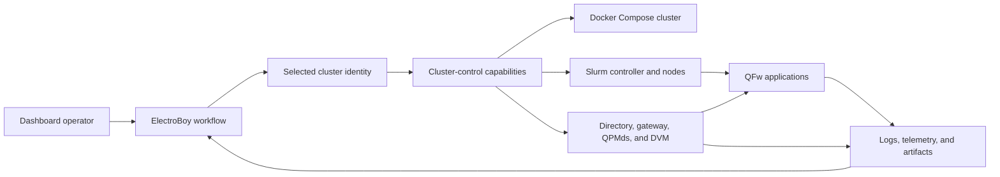

# QFw Slurm Cluster Dashboard Requirements

## Purpose

The QFw Slurm Cluster dashboard provides a graphical control and observation
surface for the virtual Slurm environment, its QFw service plane, and the
experiments executed within it. The dashboard is delivered as an ElectroBoy
workflow owned by the `QFw-SLURM-Cluster` repository.

The workflow helps application developers and cluster operators understand the
complete execution path without replacing the command-line tools that manage
it. Every operation exposed by the dashboard must remain available through a
stable command or service interface suitable for terminals and automation.

The dashboard covers these activities:

- Build, start, inspect, stop, and recreate the virtual cluster.
- Start, stop, inspect, and recover the QFw service plane.
- Request classical and quantum resources through Slurm.
- Launch, monitor, cancel, and compare QFw experiments.
- Correlate application, Slurm, gateway, directory, QPMd, DVM, and provider
  activity.
- Open controlled interactive shells for detailed investigation.

The operational procedures in [Cluster recipes](recipes/README.md) remain the
canonical human-readable command-line workflows.

## Scope and Ownership

The ElectroBoy workflow, its workflow-specific panes, action composition,
assets, and namespaced state belong to this repository. Reusable cluster
behavior belongs to command-line tools or narrow service interfaces owned by
the component that performs the work.

The dashboard must not become the only way to operate the cluster. It invokes
the same supported interfaces used by administrators, CI, and the documented
recipes. The workflow must not duplicate Slurm scheduling policy, QPM
admission logic, service discovery, or provider behavior.

ElectroBoy core remains workflow-neutral. The cluster workflow registers its
views and actions through supported ElectroBoy extension points. Core code must
not name QFw, Slurm, QPMd, NWQSim, IQM, or this workflow.

All dashboard implementation files live beneath `dashboard/`. This includes
workflow code, assets, schemas, configuration, tests, documentation, lifecycle
commands, generated environments, service state, and the ElectroBoy
submodule. The repository-root `.gitmodules` file is the sole layout exception
required by Git.

Existing cluster scripts, Docker definitions, Slurm configuration, and QFw
configuration remain unchanged. The dashboard invokes their public interfaces.
No dashboard implementation belongs in QFw, DEFw, qfw-slurm, or another
repository. ElectroBoy may receive a workflow-neutral extension when an
existing public interface cannot support a required reusable capability.

The first dashboard release has no backward-compatibility obligations. Its
public capability contracts must nevertheless be explicit and versioned so
that future releases can evolve them deliberately.

## System Context



The browser must communicate with a trusted ElectroBoy backend. It must not
receive direct access to the Docker socket, root SSH credentials, protected
QPM state, or provider credentials.

## Cluster Identity Selection

The dashboard is a trusted development tool for the virtual cluster. It does
not authenticate its operator or implement an independent role system.
Instead, it provides an active cluster-identity selector.

| Selection | Intended use |
| --- | --- |
| `user-a` | Run and inspect work as the first regular test user. |
| `user-b` | Run and inspect work as the second regular test user. |
| `user-c` | Run and inspect work as the third regular test user. |
| `root` | Start services, recover components, and perform cluster administration. |

Every operation directed into the cluster runs under the selected account.
This includes Slurm requests, QFw applications, status commands, log access,
artifact access, and shells. The cluster's Unix permissions, Slurm ownership,
home directory, and login environment determine what that operation can do.

Host-side Docker Compose and image-build actions run through the ElectroBoy
service account because they operate outside the containers. The dashboard
offers those actions only while `root` is the selected cluster identity and
labels them as host-administrator operations.

| ID | Requirement |
| --- | --- |
| DASH-200 | The dashboard shall provide one active identity selector containing `root`, `user-a`, `user-b`, and `user-c`. |
| DASH-201 | `user-a` shall be the default identity for a newly created dashboard workspace. |
| DASH-202 | Every in-cluster capability request shall include the selected identity explicitly. |
| DASH-203 | The backend shall run each in-cluster command with the selected account's UID, GID, home directory, shell, and login environment. |
| DASH-204 | Slurm allocations and experiments shall be submitted and owned by the selected identity. |
| DASH-205 | Status, log, artifact, and shell operations shall receive the permissions and visibility of the selected identity. |
| DASH-206 | Selecting `root` shall permit the root-owned service-plane and recovery workflows supported by the virtual cluster. |
| DASH-207 | The active identity shall be visible in the global header and repeated on every mutating-action confirmation. |
| DASH-208 | An operation shall capture its identity when submitted. Changing the selector shall affect only subsequent operations. |
| DASH-209 | Running jobs, experiments, log streams, and shells shall continue under their captured identities after the active selector changes. |
| DASH-210 | Results, logs, terminals, and audit events shall display the identity under which their operation was created. |
| DASH-211 | Host-side build and Docker lifecycle actions shall require `root` selection and shall be marked as host-administrator actions. |
| DASH-212 | Repository document access shall use the host ElectroBoy service account because the files reside outside the virtual cluster. |
| DASH-213 | The dashboard shall not present the identity selector as authentication or as a production security boundary. |

## Functional Requirements

### Workflow Packaging and Composition

| ID | Requirement |
| --- | --- |
| DASH-001 | The dashboard shall be packaged with `QFw-SLURM-Cluster` as a self-contained ElectroBoy workflow. |
| DASH-002 | The workflow shall declare its backend, frontend, configuration, asset, and runtime dependencies explicitly. |
| DASH-003 | Installing or running ElectroBoy without this workflow shall not require QFw, Slurm, Docker, or simulator dependencies. |
| DASH-004 | Disabling the workflow shall leave every command-line cluster operation available. |
| DASH-005 | Workflow state shall use a dedicated namespace and shall not add QFw-specific state to ElectroBoy core globals. |
| DASH-006 | Reusable panes and capabilities shall be separated from workflow-specific navigation and action composition. |

### Installation, Setup, and Workflow Registration

ElectroBoy runs on the Docker host that owns the cluster checkout. This gives
its trusted backend access to the repository's supported cluster commands.
ElectroBoy is not installed in the Slurm controller, compute-node, or QPM
containers.

The cluster repository pins the ElectroBoy source as a Git submodule at
`dashboard/external/electroboy`. A recursive clone populates it immediately.
An ordinary clone leaves it uninitialized until the user enables the
dashboard.

The installation uses ElectroBoy's split production packages. It installs
`electroboy-core` and `electroboy-modules`. Core supplies the workspace and
split-pane shell. The modules package supplies reusable file-browser,
Markdown-document, and project-shell capabilities. It does not register
another workflow. The installation does not include the aggregate `electroboy`
package,
`electroboy-workflow-software`, or
`electroboy-workflow-creative-writing`.

The cluster workflow is an installable package within this repository. It
registers one factory through the `electroboy.workflows` entry-point group.
The canonical workflow identifier is `qfw-slurm-cluster`.

| ID | Requirement |
| --- | --- |
| DASH-007 | The repository shall contain an ElectroBoy Git submodule at `dashboard/external/electroboy`, pinned to a reviewed commit. |
| DASH-008 | Cloning with `--recurse-submodules` shall provide the complete dashboard source dependency. |
| DASH-009 | `dashboard/enable.sh` shall initialize an absent submodule to the commit recorded by the parent repository. |
| DASH-160 | The repository shall provide `dashboard/enable.sh` to create or update the complete optional dashboard installation. |
| DASH-161 | Dashboard enablement shall use a dedicated host-side Python virtual environment and a dedicated ElectroBoy service state root beneath `dashboard/`. |
| DASH-162 | Enablement shall install `electroboy-core` from the pinned submodule rather than installing ElectroBoy's aggregate root distribution. |
| DASH-163 | Enablement shall install `electroboy-modules` and shall enable only the reusable capabilities declared by the cluster workflow. |
| DASH-164 | Enablement shall install the cluster-owned workflow as a separate Python distribution with an `electroboy.workflows` entry point named `qfw-slurm-cluster`. |
| DASH-165 | The generated workflow configuration shall have an empty built-in workflow list and exactly one enabled external workflow, `qfw-slurm-cluster`. |
| DASH-166 | The installed environment shall not contain the software-engineering or creative-writing workflow distributions. |
| DASH-167 | Enablement shall fail if workflow discovery does not return exactly the expected `qfw-slurm-cluster` workflow. |
| DASH-168 | Enablement shall record the ElectroBoy commit, cluster workflow revision, Python interpreter, virtual-environment path, and service-state path. |
| DASH-169 | Repeating enablement with the same inputs shall preserve service state and produce the same registered workflow set. |
| DASH-170 | `dashboard/enable.sh` shall support `--dry-run` and shall display every resolved source, revision, installation path, and service setting without changing the host. |
| DASH-171 | Updating the pinned ElectroBoy commit shall require a normal parent-repository submodule-pointer change. Enablement shall not follow an unpinned remote branch. |
| DASH-172 | The normal cluster configure, build, and startup procedures shall not initialize, build, install, register, enable, or start ElectroBoy. |
| DASH-173 | Dashboard enablement failure shall report the failed installation or registration step without changing the built cluster environment. |
| DASH-174 | Cluster image construction shall remain independent of ElectroBoy and shall not copy the ElectroBoy source, virtual environment, or service state into the image. |
| DASH-175 | The `dashboard/` directory shall provide supported start, stop, status, and log commands for the host-side ElectroBoy service. |
| DASH-176 | The ElectroBoy service shall default to a loopback listener. Binding to a non-loopback address shall require explicit authenticated deployment configuration. |
| DASH-253 | Every dashboard implementation file except `.gitmodules` shall reside beneath `dashboard/`. |
| DASH-254 | Existing repository-root cluster scripts and configuration shall not be modified to enable or operate the dashboard. |
| DASH-255 | QFw, DEFw, qfw-slurm, and other OpenQSE repositories shall not be modified for dashboard-specific behavior. |
| DASH-256 | An ElectroBoy change shall be permitted only when it provides a reusable workflow-neutral capability through a public interface. |
| DASH-257 | After an ElectroBoy change passes core-only tests, the cluster repository shall consume it by updating the dashboard submodule pointer. |
| DASH-258 | `dashboard/disable.sh` shall stop and disable the dashboard while preserving its virtual environment and service state. |
| DASH-259 | An explicit `dashboard/disable.sh --purge` shall remove generated dashboard installation and state without changing cluster state or tracked sources. |

The expected persisted workflow selection is equivalent to:

```json
{
  "schema_version": 1,
  "enabled_builtins": [],
  "extra_workflows": [
    {
      "id": "qfw-slurm-cluster",
      "factory": "entry-point:qfw-slurm-cluster"
    }
  ]
}
```

The enable command owns dashboard dependency installation and workflow
registration. Cluster lifecycle commands own Docker and Slurm state. Enabling,
disabling, starting, or stopping ElectroBoy must not implicitly build, start,
stop, or recreate the cluster.

### Workspace and Pane Composition

The cluster workflow uses ElectroBoy's existing composable workspace. It
offers four pane types named Dashboard, Progress, File, and Shell. Splitting
the workspace allows one of these pane types to appear beside another.

The Dashboard pane has a fixed set and arrangement of cluster widgets. A user
may collapse or expand a widget, but cannot remove, replace, or rearrange it.
This preserves a predictable operating surface.

| ID | Requirement |
| --- | --- |
| DASH-177 | The workflow shall use ElectroBoy's existing split-pane infrastructure rather than implement a dashboard-specific layout manager. |
| DASH-178 | The cluster workflow shall offer exactly four selectable pane types named Dashboard, Progress, File, and Shell. |
| DASH-179 | Users shall be able to split panes horizontally and vertically and place any of the four pane types in a split. |
| DASH-180 | The Dashboard pane shall present a fixed set and arrangement of workflow-owned widgets. |
| DASH-181 | Users shall be able to collapse and expand each dashboard widget. |
| DASH-182 | Users shall not be able to remove, replace, reorder, or freely position dashboard widgets. |
| DASH-183 | The workflow shall use the reusable ElectroBoy file-browser and Markdown-document modules for the File pane. |
| DASH-184 | The File pane shall browse the `QFw-SLURM-Cluster` checkout and other roots configured for the host ElectroBoy service. |
| DASH-185 | Selecting a Markdown file shall open it through the existing document capability without replacing unrelated panes. |
| DASH-186 | The host ElectroBoy service account shall be able to view, edit, and save Markdown files using the existing document capability. |
| DASH-187 | Markdown views shall expose unsaved state and shall detect a conflicting filesystem revision before overwriting it. |
| DASH-188 | The workflow shall use the reusable ElectroBoy project-shell capability for the Shell pane. |
| DASH-189 | The Progress pane shall present structured operation progress and correlated textual logs. |
| DASH-190 | Pane layout, selected pane types, pane context, and open documents shall be stored in the workflow's namespaced workspace state. |
| DASH-191 | Reopening the workspace shall restore its pane arrangement without changing cluster or experiment state. |
| DASH-192 | File access shall remain within configured host roots and shall use the ElectroBoy service account's filesystem permissions. |
| DASH-193 | The cluster workflow shall consume public module interfaces and shall not copy or import private file-browser, document, shell, progress, or pane implementation details. |

### Dashboard Widgets and External Windows

Every dashboard widget can be popped out into its own browser window. The
widget remains visible in the Dashboard pane. Both renderings mirror one
logical widget instance and remain synchronized in both directions.

| ID | Requirement |
| --- | --- |
| DASH-230 | Every dashboard widget shall offer a pop-out action that opens a separate browser window. |
| DASH-231 | Popping out a widget shall not remove, replace, collapse, or otherwise change its dashboard rendering. |
| DASH-232 | The dashboard and external window shall use one stable widget-instance identifier. |
| DASH-233 | Both renderings shall display the same data, filters, selection, expansion state, graph focus, and update time. |
| DASH-234 | An interaction in either rendering shall update the other rendering without a page reload. |
| DASH-235 | Both renderings shall subscribe to one logical data source and shall not independently poll the cluster. |
| DASH-236 | Requesting pop-out for an already open widget shall focus its existing external window. |
| DASH-237 | Closing the external window shall leave the dashboard widget and its state unchanged. |
| DASH-238 | Reloading either rendering shall reconstruct the shared widget state and resume live updates. |
| DASH-239 | Losing the opener window shall not leave an external widget displaying silently stale state. It shall reconnect or report disconnection. |
| DASH-240 | The external window shall resize responsively and shall identify the cluster, selected identity, widget, and observation freshness. |
| DASH-241 | Widget-window synchronization shall extend ElectroBoy's existing pop-out and pane-synchronization mechanisms. |

### Cluster Overview

| ID | Requirement |
| --- | --- |
| DASH-010 | The dashboard shall present one aggregate cluster health state with the observation timestamp and data freshness. |
| DASH-011 | The overview shall report Docker containers, Slurm controller, Slurm database, MUNGE, qfw-slurm gateway, and QFw service-plane health. |
| DASH-012 | Nodes shall be grouped by partition and operational role, including application nodes, NWQSim service nodes, and the IQM service node. |
| DASH-013 | Each node shall show Slurm state, reason, features, CPU count, memory, allocation state, and container health when available. |
| DASH-014 | The overview shall distinguish unavailable monitoring data from a confirmed component failure. |
| DASH-015 | The dashboard shall provide a topology view connecting the controller, partitions, nodes, directory service, gateway, QPMds, DVM, and applications. |
| DASH-016 | A user shall be able to filter nodes by name, partition, role, feature, and state. |

### Topology Widget

The Topology widget provides two fixed projections. The cluster projection
shows infrastructure and service relationships. The experiment projection
shows how an experiment maps onto Slurm and QFw resources.

| ID | Requirement |
| --- | --- |
| DASH-242 | The Topology widget shall provide Cluster and Experiment projections. |
| DASH-243 | The Cluster projection shall show the controller, partitions, nodes, directory service, gateway, QPMds, DVM, and simulator members. |
| DASH-244 | The Experiment projection shall show the experiment, Slurm job, heterogeneous groups, allocated nodes, job steps, QPM reservations, provider jobs, results, and artifacts that exist. |
| DASH-245 | Topology objects shall display their current state and shall update as authoritative cluster and experiment state changes. |
| DASH-246 | Selecting an object shall display its details and shall make its correlation identifiers available to other workflow views. |
| DASH-247 | Selecting a node, job, reservation, or service shall be able to set the context of a Progress pane. |
| DASH-248 | Selecting a result or artifact shall open the corresponding result detail or file view. |
| DASH-249 | The graph layout shall remain stable while status values change. |
| DASH-250 | Users may zoom, pan, filter, and select the graph but shall not edit its authoritative relationships. |
| DASH-251 | The same objects and states shall be available in a tabular view. |
| DASH-252 | The Topology widget shall support the standard widget external-window mirroring behavior. |

### Cluster Lifecycle

| ID | Requirement |
| --- | --- |
| DASH-020 | With `root` selected, an operator shall be able to build, start, stop, restart, and recreate the virtual cluster through supported repository commands. |
| DASH-021 | Before executing an action, the dashboard shall display the selected repository, branch, image, configuration, and affected components. |
| DASH-022 | Long-running operations shall stream progress and preserve their terminal result. |
| DASH-023 | Repeated lifecycle requests shall be idempotent where the underlying operation permits it. |
| DASH-024 | Destructive operations, including removal of named volumes, shall require explicit confirmation that names the affected state. |
| DASH-025 | Lifecycle failure shall preserve command output, exit status, timestamps, and recovery guidance. |

### QFw Service Plane

| ID | Requirement |
| --- | --- |
| DASH-030 | The dashboard shall show the directory service, qfw-slurm gateway, each QPMd, and the NWQSim PRTE DVM independently. |
| DASH-031 | Service details shall include owner node, lifecycle state, readiness, endpoint, process identity, start time, runtime identity, and generation when available. |
| DASH-032 | The NWQSim view shall show the DVM master, participating simulator nodes, URI readiness, and QPM association. |
| DASH-033 | Each QPMd shall show its service ID, backend, target device, assigned hosts, active reservation count, and sanitized admission state. |
| DASH-034 | With `root` selected, an operator shall be able to start or stop the complete service plane through `qfw-site-services`. |
| DASH-035 | With `root` selected, an operator shall be able to start, stop, restart, and inspect an individual directory service or QPMd through its canonical manager. |
| DASH-036 | Dependency-aware actions shall prevent a directory service from being stopped while managed QPMds still depend on it unless a complete ordered shutdown was selected. |
| DASH-037 | Service actions shall display partial failure and the cleanup performed by the underlying manager. |
| DASH-038 | Credential readiness shall report configured, missing, disabled, unreadable, or unknown without exposing credential material. |

### Resource Requests and Reservations

| ID | Requirement |
| --- | --- |
| DASH-040 | The resource form shall collect a QPU alias, workload kind, circuit count, maximum qubits, maximum depth, maximum shots, and optional gate and measurement bounds. |
| DASH-041 | The form shall collect Slurm partition, nodes, tasks, walltime, account, QoS, and other permitted classical resource settings. |
| DASH-042 | The form shall support normal and heterogeneous allocations. Each heterogeneous component shall expose its own classical requirements. |
| DASH-043 | Quantum requirements shall be attached at allocation time through the existing qfw-slurm interface rather than added to an application `srun`. |
| DASH-044 | The dashboard shall validate required fields, numeric ranges, service aliases, and incompatible combinations before submission. |
| DASH-045 | The user shall be able to inspect the exact `salloc` or `sbatch` request before submitting it. |
| DASH-046 | The dashboard shall use Slurm and qfw-slurm for scheduling and admission. It shall not reserve QPM capacity through an independent UI-only path. |
| DASH-047 | Pending requests shall show whether they are waiting for preliminary quantum evaluation, classical resources, final QPM admission, or another known condition. |
| DASH-048 | Permanent QPM rejection shall be displayed as an allocation failure with the sanitized reason returned by the scheduling workflow. |
| DASH-049 | Cancellation shall trigger the normal Slurm and gateway cleanup path and shall display the resulting reservation-release state. |

### Experiment Launch

| ID | Requirement |
| --- | --- |
| DASH-050 | The dashboard shall discover supported installed QFw examples and their documented parameters. |
| DASH-051 | Experiment definitions shall identify compatible backends, required services, resource bounds, expected artifacts, and hardware risk. |
| DASH-052 | A user shall be able to select an existing allocation or request a new allocation before running an experiment. |
| DASH-053 | Experiment launch shall use the installed QFw activation, setup, execution, teardown, and deactivation lifecycle. |
| DASH-054 | Site mode shall connect applications to persistent services without starting application-owned QPMds. |
| DASH-055 | Experiment presets shall be saveable as non-secret, reviewable configuration. |
| DASH-056 | A submitted experiment shall record its owner, command, parameters, allocation, QPM reservations, revisions, timestamps, and artifact location. |
| DASH-057 | A real-IQM experiment shall require explicit hardware confirmation and operator-defined upper bounds for shots, qubits, circuits, tasks, and runtime. |
| DASH-058 | The launch interface shall never accept an API key or refresh token as an experiment parameter. |

### Experiment Progress

| ID | Requirement |
| --- | --- |
| DASH-060 | Each experiment shall expose a timeline covering submission, quantum evaluation, classical wait, final admission, execution, completion, teardown, and reservation release. |
| DASH-061 | The timeline shall correlate Slurm job and heterogeneous component IDs with QPM service and reservation IDs. |
| DASH-062 | The dashboard shall distinguish application failure, Slurm failure, QPM rejection, provider failure, cancellation, timeout, and monitoring failure. |
| DASH-063 | A missing terminal application result shall not be reported as success. |
| DASH-064 | Progress shall update without requiring a full page reload. |
| DASH-065 | A regular selected identity shall be able to cancel its owned experiments. Root selection shall permit cancellation of any virtual-cluster experiment. |
| DASH-066 | Retry shall create a new experiment record and use the normal allocation workflow rather than mutating the history of the failed run. |
| DASH-214 | The Progress pane shall provide Timeline and Logs modes over the selected operation context. |
| DASH-215 | The Progress pane context tool menu shall first filter by component category. |
| DASH-216 | Component categories shall include cluster build, Docker, Slurm, application, gateway, directory service, QPMd, DVM, simulator, and provider client. |
| DASH-217 | After selecting a component, the context tool menu shall offer available component instances, nodes, jobs, services, and reservations. |
| DASH-218 | Within the selected component context, the menu shall filter by debug, informational, warning, error, and critical severity when supplied by the source. |
| DASH-219 | The Progress pane shall also support time-range filtering, text search, pause, resume, and live follow. |
| DASH-220 | More than one Progress pane may be open, and each shall retain independent context and filter state. |
| DASH-221 | A Progress pane shall display the active filters, selected identity, stream status, and observation freshness. |
| DASH-222 | Changing the global identity selector shall not retarget an existing Progress pane created under another captured identity. |

### Results and Reproducibility

| ID | Requirement |
| --- | --- |
| DASH-070 | The result view shall show terminal status, exit code, measurement counts, normalized QFw results, and timing telemetry when produced. |
| DASH-071 | The view shall list application output, generated files, QFw event records, and other retained artifacts. |
| DASH-072 | The selected identity shall be able to download artifacts readable by that cluster account. |
| DASH-073 | Every run shall produce a reproducibility manifest containing component revisions, container image, backend configuration identity, resource request, command, parameters, and timestamps. |
| DASH-074 | Users shall be able to compare compatible runs without changing their underlying result records. |
| DASH-075 | Result retention and deletion shall follow an explicit site policy and preserve audit records required by that policy. |

### Logs

| ID | Requirement |
| --- | --- |
| DASH-080 | The dashboard shall stream application, Slurm, gateway, directory-service, QPMd, DVM, and provider-client logs visible to the selected identity. |
| DASH-081 | Log records shall identify source, node, service, job, reservation correlation, severity, and timestamp when known. |
| DASH-082 | The Progress pane shall filter logs by component, instance, node, service, job, reservation, severity, text, and time range. |
| DASH-083 | A correlated view shall place records from several components on one experiment timeline. |
| DASH-084 | Streaming shall support pause, resume, follow, and bounded historical retrieval. |
| DASH-085 | Secrets, authorization material, and protected user data shall be redacted before a log record reaches the browser. |
| DASH-086 | Regular users shall see their own application logs and sanitized shared-service logs. Root selection shall expose the broader operational log set. |

### Interactive Shells

| ID | Requirement |
| --- | --- |
| DASH-090 | A regular selected identity shall be able to open a terminal on the controller or a node allocated to that account. |
| DASH-091 | With `root` selected, an operator shall be able to open service-node terminals for diagnosis. |
| DASH-092 | A root terminal shall require `root` selection and a separate explicit confirmation. |
| DASH-093 | Every terminal shall display the effective user, target host, working directory, and cluster identity. |
| DASH-094 | Shell sessions shall use disposable PTYs with bounded idle lifetime and explicit closure. |
| DASH-095 | Session creation, target, identity, start, end, and termination reason shall be audited without recording credential material. |
| DASH-096 | Shell access shall use the active cluster identity and the account definitions provisioned in the virtual cluster. |

### Diagnostics and Recovery

| ID | Requirement |
| --- | --- |
| DASH-100 | Diagnostics shall check container health, MUNGE identity, clock consistency, Slurm registration, configured CPU count, shared mounts, module availability, and service connectivity. |
| DASH-101 | QFw diagnostics shall check the directory connection record, service registration, QPM readiness, DVM URI, assigned hosts, gateway connectivity, and credential readiness. |
| DASH-102 | Each failed check shall report its evidence, observation time, affected component, and an appropriate recipe or manual reference. |
| DASH-103 | Recovery actions shall invoke supported managers and Slurm commands rather than deleting PID, readiness, URI, or journal files directly. |
| DASH-104 | With `root` selected, the dashboard shall support node drain, resume, and reason inspection. |
| DASH-105 | Recovery shall expose stale service state, failed QPM registration, unavailable DVM members, pending allocations, and incomplete reservation release. |
| DASH-106 | Before a recovery action, the dashboard shall identify the state that will be retained, replaced, or removed. |

### Audit and Notifications

| ID | Requirement |
| --- | --- |
| DASH-110 | Privileged actions, hardware submissions, experiment cancellation, recovery, and shell creation shall create audit events. |
| DASH-111 | Audit records shall contain the selected cluster identity, host-side service identity when applicable, action, target, request identifier, start and completion times, and outcome. |
| DASH-112 | Audit records shall exclude provider credentials, application authorization tokens, and unredacted protected configuration. |
| DASH-113 | Users shall be able to subscribe to experiment completion and failure notifications. |
| DASH-114 | Operators shall be able to subscribe to service failure, node drain, gateway failure, and incomplete release notifications. |
| DASH-115 | Notification delivery failures shall not alter cluster, reservation, or experiment state. |

## Cluster-Control Capability Requirements

The ElectroBoy backend needs narrow capabilities that return structured data.
Existing commands with JSON output should be reused. Repository adapters may
normalize output from Docker, Slurm, or manager commands when no suitable
machine-readable interface exists.

Conceptual capability groups include:

```text
cluster status|start|stop|recreate
services list|status|start|stop|restart
nodes list|inspect|drain|resume
allocations preview|submit|status|cancel
experiments list|submit|status|cancel|artifacts
logs query|follow
shell open|resize|close
```

These names describe capability boundaries rather than prescribing one
executable. The implementation may extend existing commands or provide a
dedicated adapter, provided the following requirements hold.

| ID | Requirement |
| --- | --- |
| DASH-120 | Every capability shall have a versioned request and response contract. |
| DASH-121 | Structured responses shall include schema version, outcome, timestamps, and typed error information. |
| DASH-122 | Long-running actions shall expose an operation identifier and observable progress. |
| DASH-123 | Mutating requests shall carry a caller-generated idempotency identifier where repetition could duplicate work. |
| DASH-124 | The backend shall use allow-listed commands and validated arguments rather than accepting arbitrary shell strings from dashboard actions. |
| DASH-125 | Capabilities shall run through a constrained backend that validates the selected identity and uses allow-listed execution mechanisms. The browser shall not hold cluster credentials. |
| DASH-126 | Capability output shall preserve the identifiers needed to correlate containers, nodes, jobs, heterogeneous components, services, reservations, and experiments. |
| DASH-127 | Failure responses shall distinguish command failure, timeout, unavailable component, permission failure, invalid input, and stale observations. |
| DASH-128 | CI shall be able to invoke the same capability contracts without rendering the dashboard. |

## Safety and Isolation Requirements

| ID | Requirement |
| --- | --- |
| DASH-130 | Provider API keys, refresh tokens, application authorization tokens, and protected credential records shall never be sent to the browser. |
| DASH-131 | The dashboard shall report credential readiness using sanitized state only. |
| DASH-132 | Operations executed as a regular selected identity shall not gain read access to root-owned service run directories. |
| DASH-133 | Job, artifact, log, and shell access shall use the selected cluster identity and the cluster's normal ownership checks. |
| DASH-134 | Cross-user views shall expose only the information allowed by Slurm and QFw site policy. |
| DASH-135 | Real-hardware actions shall be visually distinct from simulator actions and require an explicit confirmation containing the requested bounds. |
| DASH-136 | The virtual-cluster dashboard shall default to a loopback-only local deployment and shall identify that boundary in its status view. |
| DASH-137 | User-provided names, paths, filters, and experiment parameters shall be validated before reaching subprocesses or filesystem operations. |
| DASH-138 | Logs and command output shall pass through centralized secret-redaction rules before storage or streaming. |

## Reliability and Performance Requirements

| ID | Requirement |
| --- | --- |
| DASH-140 | Loss of the dashboard shall not stop the cluster, service plane, allocation, or experiment. |
| DASH-141 | Reconnecting shall reconstruct observable state from authoritative cluster components and retained experiment records. |
| DASH-142 | Dashboard polling shall not place scheduling policy or admission polling inside the UI process. Slurm and QPMd remain authoritative. |
| DASH-143 | Status collection shall use bounded timeouts and shall continue reporting healthy components when one source is unavailable. |
| DASH-144 | Log streaming shall apply backpressure and bounded buffering so that a noisy source cannot exhaust the dashboard backend or browser. |
| DASH-145 | The overview shall identify the age of cached information and permit a manual refresh. |
| DASH-146 | A mutating operation shall expose one terminal outcome even if the initiating browser disconnects. |
| DASH-147 | Dashboard monitoring shall not materially delay Slurm scheduling, QPM admission, or application RPC traffic. |

## Usability Requirements

| ID | Requirement |
| --- | --- |
| DASH-150 | The default landing page shall answer whether the cluster is usable and identify the component preventing use when it is not. |
| DASH-151 | Simulator and real-hardware paths shall use distinct labels and visual treatment. |
| DASH-152 | Every state label shall have a textual representation and shall not rely on color alone. |
| DASH-153 | Tables shall support sorting, filtering, stable identifiers, and direct navigation to related detail views. |
| DASH-154 | Dangerous actions shall show scope and consequences before confirmation. |
| DASH-155 | Command previews and failure views shall link to the relevant installed manual or repository recipe. |
| DASH-156 | Empty, loading, stale, permission-denied, and error states shall be visually distinct. |

## Configuration and Version Inventory

The dashboard shall expose a sanitized deployment inventory containing:

- QFw, DEFw, qfw-slurm, and cluster repository revisions.
- Container image identifiers and container creation times.
- Slurm, MUNGE, Python, simulator, MPI, PRTE, and libfabric versions.
- Enabled modulefiles and service manifests.
- Active site-configuration paths and non-secret configuration fingerprints.
- ElectroBoy and dashboard-workflow versions.

Configuration contents that include credentials or authorization material must
not be displayed. Operators may inspect a redacted view and compare its
fingerprint with the configuration recorded for an experiment.

## Delivery Phases

### Phase 0: Reproducible Dashboard Enablement

The enablement phase adds the pinned ElectroBoy submodule, the cluster workflow
package, the host-side virtual environment, workflow selection, and service
lifecycle commands. It remains optional and separate from the normal cluster
configure, build, and startup procedures.

Acceptance requires:

- A recursive clone followed by enablement installs the pinned ElectroBoy
  commit.
- An ordinary clone does not initialize or build ElectroBoy.
- Enabling the dashboard after an ordinary clone initializes the missing
  submodule and installs the pinned commit.
- Workflow discovery returns only `qfw-slurm-cluster`.
- Software and creative-writing workflow distributions are absent.
- Dashboard, Progress, File, and Shell are the only selectable pane types.
- Reusable file-browser, Markdown-document, shell, and pane capabilities are
  available to the cluster workflow.
- Repeated enablement preserves the dedicated service state.
- Disabling preserves the installed environment and state unless `--purge` is
  explicit.
- Cluster commands remain usable while the ElectroBoy service is stopped.

### Phase 1: Read-only Observation

The first phase provides cluster health, node and partition state, QFw service
status, topology, version inventory, and links to the operational recipes. It
introduces the machine-readable status contracts and contains no mutating
actions.

Acceptance requires:

- Accurate reporting for a stopped, partially started, and ready cluster.
- Continued reporting when one component is unavailable.
- Correct identity-specific permissions and redaction.
- A Markdown recipe can remain open beside the live cluster overview.
- The workspace restores a saved split-pane arrangement.
- No QFw- or Slurm-specific dependency in ElectroBoy core.

### Phase 2: Controlled Lifecycle Actions

The second phase adds cluster and service-plane start, stop, restart, and
recovery actions. Long-running operations expose progress and retained terminal
results.

Acceptance requires:

- The complete service plane can be started and stopped through the dashboard.
- Partial startup failure reports cleanup and preserves diagnostics.
- Destructive cluster recreation requires explicit confirmation.
- The same lifecycle remains usable from the documented CLI.

### Phase 3: Allocation and Experiment Execution

The third phase adds normal and heterogeneous resource forms, command preview,
Slurm submission, installed example selection, and experiment timelines.

Acceptance requires:

- An NWQSim job completes through the persistent site QPMd.
- A heterogeneous NWQSim job receives one consistent reservation set.
- Cancellation releases the associated QPM reservation.
- A bounded real-IQM run requires explicit approval and does not expose its
  credential.

### Phase 4: Results and Correlated Logs

The fourth phase adds result records, artifacts, reproducibility manifests,
live log streaming, historical queries, and cross-component correlation.

Acceptance requires:

- A terminal application result is distinguished from mere job submission.
- Application and QPM events can be correlated with one allocation.
- Log filters operate without exposing protected service data.
- Reconnecting to the dashboard reconstructs completed experiment state.

### Phase 5: Shells and Advanced Recovery

The fifth phase adds controlled PTYs, audit history, node administration,
advanced service recovery, and notifications.

Acceptance requires:

- Regular-user shells are limited to nodes available to the selected account.
- Root shells require `root` selection and a separate confirmation.
- Shell and privileged recovery actions produce audit records.
- Dashboard loss terminates or expires orphaned shell sessions without
  affecting cluster workloads.

## Detailed Implementation Checklist

Work proceeds in the order below. A unit is complete only after its completion
gate passes. If implementation reveals a requirement change, update and review
this document before continuing. Each unit should produce one focused commit
or a small set of commits divided by the functional boundaries listed here.

### Unit 1: Freeze Interfaces and Ownership

- [ ] Map every dashboard view and action to its owning repository, module,
  command, and requirement identifiers.
- [ ] Inventory the existing ElectroBoy workflow, pane, tool-menu, pop-out,
  synchronization, route, state, and asset extension points.
- [ ] Inventory JSON output from Docker, Slurm, `qfw-site-services`,
  `qfw-sinfo`, `qfw-squeue`, and the QFw service managers.
- [ ] Identify commands that need a structured adapter instead of terminal
  output parsing.
- [ ] Define versioned records for cluster, node, service, allocation,
  experiment, progress event, log event, result, and operation state.
- [ ] Define identifiers that correlate containers, Slurm jobs,
  heterogeneous groups, nodes, QPM services, reservations, and experiments.
- [ ] Confirm that the QFw workflow requires no import or dispatch rule in
  ElectroBoy core.

Completion gate:

- [ ] Every planned route, view, action, and state record has one owner and a
  narrow interface.
- [ ] No UI code is designated as the owner of scheduling, admission, service
  discovery, or cluster lifecycle policy.

### Unit 2: Add Reproducible ElectroBoy Enablement

- [ ] Create the self-contained `dashboard/` implementation directory.
- [ ] Add `dashboard/external/electroboy` as a Git submodule pinned to a
  reviewed commit.
- [ ] Limit repository-root changes to the required `.gitmodules` entry.
- [ ] Add the cluster-owned Python workflow distribution and its
  `qfw-slurm-cluster` entry point.
- [ ] Declare the precise `electroboy-core` and `electroboy-modules`
  dependencies needed by the workflow.
- [ ] Add `dashboard/enable.sh` with `--help`, `--dry-run`, and repeatable
  enablement behavior.
- [ ] Make enablement initialize an absent submodule to the recorded commit.
- [ ] Create a dedicated host virtual environment and service-state root
  beneath `dashboard/`.
- [ ] Install the split ElectroBoy packages without installing the aggregate,
  software-workflow, or creative-writing-workflow distributions.
- [ ] Generate the workflow selection with no enabled built-ins and exactly
  one `qfw-slurm-cluster` entry.
- [ ] Validate installed entry points and fail unless the expected workflow is
  the only discoverable workflow.
- [ ] Record installed source revisions and resolved paths.
- [ ] Add dashboard-local service start, stop, status, and log commands.
- [ ] Add `dashboard/disable.sh` with state-preserving default behavior and an
  explicit `--purge` option.
- [ ] Confirm that `do_configure.sh`, `do_build.sh`, and `do_startup.sh` do not
  initialize, build, install, register, enable, or start ElectroBoy.
- [ ] Confirm that normal cluster operation does not require the submodule,
  dashboard virtual environment, or dashboard state.

Completion gate:

- [ ] Recursive and ordinary clones produce the same installation after the
  user explicitly enables the dashboard.
- [ ] An ordinary cluster build completes without fetching or building
  ElectroBoy.
- [ ] Repeated enablement preserves service state.
- [ ] Disable preserves state, while explicit purge removes only generated
  dashboard files.
- [ ] The dashboard starts while the Slurm cluster is stopped.
- [ ] The cluster image contains no ElectroBoy source, environment, or state.
- [ ] No tracked implementation file outside `dashboard/` changed except
  `.gitmodules`.

### Unit 3: Register the Workflow and Four Pane Types

- [ ] Add the QFw Slurm workflow factory, metadata, backend package, frontend
  bundle, and state namespace.
- [ ] Register only Dashboard, Progress, File, and Shell as selectable pane
  types for this workflow.
- [ ] Make Dashboard the initial pane in a new workspace.
- [ ] Set `user-a` as the initial cluster identity.
- [ ] Reuse the public File capability for repository browsing and Markdown.
- [ ] Reuse the public project-shell capability for Shell panes.
- [ ] Add the Progress pane through a workflow-owned frontend contribution and
  a narrow progress-data interface.
- [ ] Verify horizontal and vertical splits with all four pane types.
- [ ] Persist and restore pane types, split geometry, file context, shell
  context, and progress filters.

Completion gate:

- [ ] The pane chooser exposes exactly the four specified types.
- [ ] File and Shell panes work without copied module code.
- [ ] A restored workspace reproduces its prior split arrangement.

### Unit 4: Implement Cluster Identity Execution

- [ ] Add the global selector for `root`, `user-a`, `user-b`, and `user-c`.
- [ ] Display the selected identity in the workflow header.
- [ ] Include an explicit identity in every in-cluster capability request.
- [ ] Add one command-runner adapter that applies the selected UID, GID,
  `HOME`, shell, working directory, and login environment.
- [ ] Verify the effective identity inside `slurmctld`, compute nodes, and
  service nodes.
- [ ] Capture the identity on operation, allocation, experiment, stream, and
  shell creation.
- [ ] Prevent a later selector change from retargeting existing work.
- [ ] Gate host-side build and Docker actions on explicit `root` selection and
  label their host-service execution identity.
- [ ] Display the captured identity on every result, log, and shell.

Completion gate:

- [ ] Each regular user creates files and Slurm jobs with the expected
  ownership and home directory.
- [ ] A regular identity cannot read root-only QPM state.
- [ ] Switching the selector leaves existing jobs, streams, and shells under
  their original identities.

### Unit 5: Build Read-only Cluster Capabilities

- [ ] Implement structured container and Compose status collection.
- [ ] Implement structured Slurm controller, database, partition, node, and
  job status collection.
- [ ] Implement structured directory, gateway, QPMd, and DVM status
  collection.
- [ ] Include source timestamps, freshness, and typed unavailable states.
- [ ] Continue collecting healthy sources after one source fails.
- [ ] Normalize data into the versioned records from Unit 1.
- [ ] Add focused contract tests for complete, partial, stale, and malformed
  source data.
- [ ] Add a read-only diagnostics capability for MUNGE, clocks, CPU topology,
  mounts, modules, connectivity, registrations, and credentials readiness.

Completion gate:

- [ ] One aggregate response accurately represents stopped, partial, and ready
  cluster states.
- [ ] No collector requires dashboard HTML or browser state.
- [ ] CI can call every read-only capability without ElectroBoy rendering.

### Unit 6: Implement the Fixed Dashboard

- [ ] Define the fixed widget list and fixed ordering.
- [ ] Include cluster health, nodes, services, allocations, experiments,
  topology, result summary, and alerts widgets.
- [ ] Connect every widget to the shared normalized state rather than direct
  command execution.
- [ ] Add collapse and expand behavior for each widget.
- [ ] Persist collapsed state in the workflow namespace.
- [ ] Omit drag, remove, replace, and free-position controls.
- [ ] Display freshness and source failure without hiding healthy data.
- [ ] Add textual state labels that do not rely on color.

Completion gate:

- [ ] Widget order remains fixed across reload and workspace restoration.
- [ ] Every widget can be collapsed and expanded.
- [ ] No widget starts its own cluster polling loop.

### Unit 7: Add Mirrored Widget Windows

- [ ] Audit ElectroBoy's existing pane-window route, pop-out registry,
  `pane-sync.js`, and `BroadcastChannel` behavior.
- [ ] Define a public reusable widget-pop-out contract if the existing pane
  contract cannot represent a mirrored widget instance.
- [ ] Keep generic window and synchronization behavior in ElectroBoy and QFw
  widget definitions in the cluster workflow.
- [ ] Add a stable widget-instance identifier shared by both renderings.
- [ ] Add a same-origin external-window route for a widget instance.
- [ ] Keep the original dashboard widget mounted and visible after pop-out.
- [ ] Synchronize filters, selection, expansion, focus, and live data in both
  directions.
- [ ] Reuse one backend subscription for the logical widget.
- [ ] Focus the existing external window when pop-out is selected again.
- [ ] Preserve dashboard state when the external window closes.
- [ ] Reconnect or visibly disconnect the external window when its opener
  reloads, closes, or loses connectivity.
- [ ] Display cluster, identity, widget, and freshness context in the external
  window.
- [ ] Test popup blocking, reload, close, reconnect, and simultaneous input.
- [ ] If ElectroBoy changes are required, test core without the QFw workflow
  and update the submodule only after those tests pass.

Completion gate:

- [ ] Every dashboard widget can open one mirrored external browser window.
- [ ] An interaction in either rendering appears in the other.
- [ ] Closing either rendering does not corrupt the widget's shared state.
- [ ] ElectroBoy core contains no QFw-specific names or behavior.

### Unit 8: Implement Progress and Log Streaming

- [ ] Define structured progress and log event schemas with correlation IDs,
  component, instance, node, severity, timestamp, and source position.
- [ ] Add bounded collectors for build, Docker, Slurm, application, gateway,
  directory-service, QPMd, DVM, simulator, and provider-client sources.
- [ ] Redact secrets before events are stored or streamed.
- [ ] Implement Timeline and Logs modes in the Progress pane.
- [ ] Add the pane context tool menu.
- [ ] Make component category the first filter level.
- [ ] Populate instance, node, job, service, and reservation filters from the
  selected component.
- [ ] Apply severity filtering within that component context.
- [ ] Add time range, text search, pause, resume, and live-follow controls.
- [ ] Display active filters, selected identity, connection state, and
  freshness.
- [ ] Support several Progress panes with independent captured identities and
  filter state.
- [ ] Add backpressure, bounded buffering, reconnect cursors, and gap
  indicators.

Completion gate:

- [ ] Application output and QPMd errors can be followed in separate Progress
  panes during one experiment.
- [ ] Component and severity filters produce the expected subset.
- [ ] A high-volume source cannot exhaust the backend or browser.
- [ ] No known secret reaches persisted or streamed output.

### Unit 9: Implement Dynamic Topology

- [ ] Define the graph projection from normalized cluster and experiment
  records.
- [ ] Implement the fixed Cluster projection.
- [ ] Implement the fixed Experiment projection.
- [ ] Represent Slurm jobs, heterogeneous groups, allocated nodes, steps, QPM
  reservations, provider jobs, results, and artifacts.
- [ ] Add state badges and live graph updates.
- [ ] Preserve stable node positions while status changes.
- [ ] Add zoom, pan, filtering, and selection without relationship editing.
- [ ] Add a tabular rendering of the same objects and state.
- [ ] Publish selected graph identifiers through workflow context.
- [ ] Allow graph selection to set a compatible Progress pane context.
- [ ] Open result details or File context from result and artifact objects.
- [ ] Apply the standard mirrored widget-window behavior.

Completion gate:

- [ ] A live heterogeneous experiment can be followed from allocation through
  results in both dashboard and external-window renderings.
- [ ] Graph and table views contain the same objects and state.
- [ ] Graph updates do not cause unrelated nodes to move.

### Unit 10: Add Cluster and Service Mutations

- [ ] Add an operation model with identifier, captured identity, requested
  action, progress, terminal outcome, and retained output.
- [ ] Add allow-listed wrappers for build, start, stop, restart, and recreate.
- [ ] Add wrappers for complete and individual QFw service lifecycles.
- [ ] Add node drain, resume, and reason operations.
- [ ] Add idempotency identifiers and duplicate-request handling.
- [ ] Stream operation progress into Progress panes.
- [ ] Add precise confirmations for destructive actions.
- [ ] Preserve partial-failure evidence and underlying manager cleanup output.
- [ ] Link failures to the corresponding recipe and manual page.

Completion gate:

- [ ] The cluster and complete site service plane can be started and stopped
  from the dashboard with `root` selected.
- [ ] Repeated requests do not duplicate live services.
- [ ] Partial failure retains useful evidence and leaves recoverable state.

### Unit 11: Add Allocation and Experiment Workflows

- [ ] Add normal and heterogeneous classical-resource forms.
- [ ] Add all supported qfw-slurm quantum-resource fields.
- [ ] Validate types, ranges, required fields, and service aliases.
- [ ] Generate and display exact `salloc` or `sbatch` previews.
- [ ] Submit through Slurm under the captured identity.
- [ ] Track preliminary QPM evaluation, classical wait, final admission,
  execution, teardown, and release.
- [ ] Discover installed QFw examples and their supported parameters.
- [ ] Launch examples through QFw activation, setup, execution, teardown, and
  deactivation.
- [ ] Add cancel and retry behavior through the normal Slurm lifecycle.
- [ ] Require bounded values and explicit confirmation for real-IQM work.
- [ ] Prevent credential input or display in experiment forms.

Completion gate:

- [ ] A normal NWQSim experiment completes from dashboard submission.
- [ ] A heterogeneous NWQSim experiment receives one consistent reservation
  set and completes.
- [ ] Cancellation reaches terminal reservation release.
- [ ] A guarded real-IQM smoke test passes without exposing credentials.

### Unit 12: Add Results and Reproducibility

- [ ] Parse terminal QFw example records and distinguish them from successful
  submission alone.
- [ ] Present normalized results, counts, timing telemetry, exit status, and
  failure classification.
- [ ] Index application output and retained artifacts under the captured
  identity.
- [ ] Generate the reproducibility manifest.
- [ ] Add result and artifact navigation from Dashboard and Topology.
- [ ] Add compatible-run comparison without mutating source records.
- [ ] Reconstruct completed experiment state after service or browser restart.

Completion gate:

- [ ] Missing terminal output is reported as incomplete or failed.
- [ ] Every successful validation run has a complete manifest.
- [ ] Results remain readable after the dashboard service restarts.

### Unit 13: Complete Shells, Recovery, and Audit

- [ ] Open controller and allocated-node shells as the selected regular user.
- [ ] Open service-node shells only with `root` selected.
- [ ] Require a separate confirmation before opening a root shell.
- [ ] Display effective user, host, working directory, and cluster in every
  shell.
- [ ] Add idle expiry, explicit close, disconnect handling, and orphan cleanup.
- [ ] Add supported recovery actions for stale services, failed registration,
  DVM failure, pending jobs, and incomplete release.
- [ ] Record selected identity, host identity when applicable, action, target,
  request identifier, timestamps, and outcome for sensitive actions.
- [ ] Exclude credentials and protected values from audit events.
- [ ] Add completion and failure notifications without coupling notification
  delivery to operation success.

Completion gate:

- [ ] Shell and recovery tests pass for all four selectable identities.
- [ ] Root actions are clearly distinguished from regular-user actions.
- [ ] Dashboard or browser loss does not stop cluster workloads.

### Unit 14: Validate and Document the Complete Workflow

- [ ] Run unit tests for schemas, collectors, command runners, filters, state,
  redaction, and widget synchronization.
- [ ] Run ElectroBoy core-only tests after any reusable core change.
- [ ] Test the QFw workflow without software or creative-writing installed.
- [ ] Build a fresh cluster image from pinned upstream revisions.
- [ ] Exercise stopped, partial, ready, failed, and recovered cluster states.
- [ ] Run normal, heterogeneous, concurrent-user, cancellation, QPM-restart,
  and guarded hardware scenarios.
- [ ] Test every widget in the dashboard and in its mirrored external window.
- [ ] Test identity changes while jobs, Progress panes, windows, and shells are
  active.
- [ ] Add dashboard installation, startup, operation, and recovery recipes.
- [ ] Add manual pages for every new operator-facing command.
- [ ] Verify that all dashboard implementation, tests, manuals, and recipes
  reside beneath `dashboard/`.
- [ ] Verify that repository changes outside `dashboard/` consist only of the
  required `.gitmodules` entry and submodule metadata.
- [ ] Record exact component commits, image ID, tests, results, and retained
  limitations in a validation report.

Completion gate:

- [ ] Every validation-matrix case has a recorded terminal result.
- [ ] All simulator cases pass before the guarded IQM case runs.
- [ ] No deprecated workflow path or undocumented dashboard-only operation
  remains.
- [ ] A fresh clone can build and use the cluster without enabling the
  dashboard.
- [ ] A user can explicitly enable, start, and use the dashboard by following
  only the committed dashboard-local recipes.

## Validation Matrix

The implemented workflow shall be validated against these cluster states and
execution cases.

| Area | Required cases |
| --- | --- |
| Enablement | Recursive clone, ordinary clone without enablement, explicit enablement, repeated enablement, dry run, disable, purge, missing dependency, invalid workflow registration, and pinned revision update. |
| Workspace | Four pane types, horizontal and vertical splits, Markdown load and save, unsaved edits, revision conflict, layout restore, and denied path. |
| Widgets | Fixed layout, collapse, expand, every widget pop-out, bidirectional mirroring, popup blocking, reload, reconnect, and external-window close. |
| Topology | Cluster and experiment projections, live state, stable layout, selection, Progress-pane context, table parity, and external window. |
| Cluster | Stopped, starting, healthy, partial container failure, and recreation. |
| Nodes | Idle, allocated, mixed, drained, down, and stale observation. |
| Services | Stopped, starting, ready, partial QPM failure, DVM failure, gateway failure, and QPM restart. |
| Allocations | Normal, heterogeneous, pending classical resources, delayed QPM admission, rejection, cancellation, and timeout. |
| Experiments | Successful NWQSim, application failure, missing terminal result, cancellation, and guarded real-IQM. |
| Identities | `user-a`, `user-b`, `user-c`, `root`, identity switch during an operation, and permission denial. |
| Logs | Multiple sources, high volume, reconnect, filtering, redaction, and unavailable source. |
| Shells | Regular-user allocated node, denied node, root service node, root confirmation, idle timeout, and disconnect. |

The existing service validation report in
[Persistent QFw service validation](qfw-service-validation.md) defines the
baseline behavior that the dashboard must observe without regression.

## Out of Scope

The dashboard does not replace or reimplement:

- Slurm scheduling and allocation policy.
- qhw-admission capacity decisions.
- qfw-slurm allocation integration or gateway protocol.
- DEFw directory registration and service discovery.
- QPMd reservation validation or provider execution.
- Provider credential generation and rotation.
- General administration of production clusters outside the virtual
  `QFw-SLURM-Cluster` environment.

Future workflows may reuse generic capabilities introduced for this dashboard,
but this requirement does not define a universal HPC management interface.
